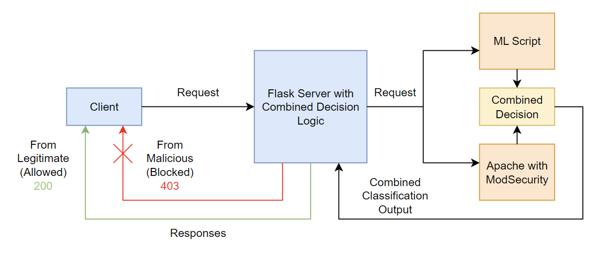
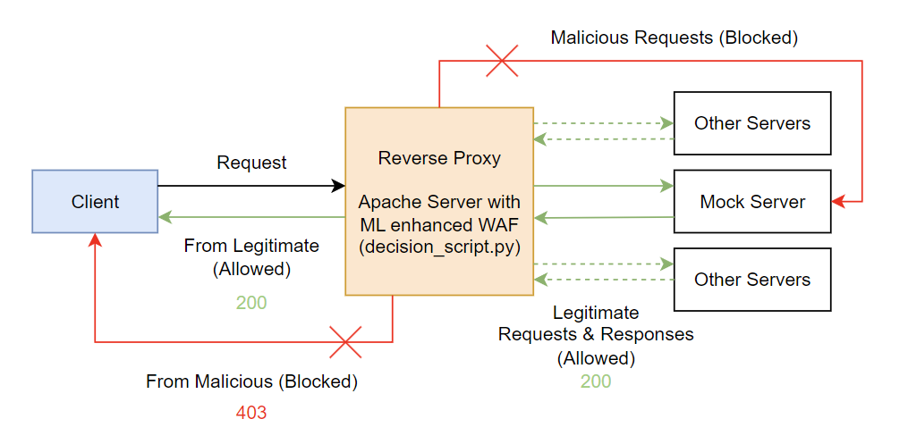

# **NetworkSecurity Project**  
## **WAF Combining ModSecurity and Machine Learning for SQL Injection Protection**

This project demonstrates a practical approach to enhancing Web Application Firewall (WAF) defenses by integrating traditional signature-based protection, provided by **ModSecurity**, with modern machine learning-based anomaly detection from the **ModSec-AdvLearn** framework. The goal is to achieve a **combined decision-making system** to detect and block **SQL Injection (SQLi)** attacks more effectively in a **simulated real-world environment using Apache**.

By combining these two complementary approaches, we can mitigate both known and unknown (zero-day) SQL injection threats through continuous learning and rule-based protection.

We initially developed this project using a Flask server to test the newly introduced combined decision logic mechanism. In the second phase, we eliminated reliance on the Flask server by designing a dedicated single-decision script, executed by the Apache Web Server, to analyze each incoming request and filter out malicious ones. Finally, we reintroduced Flask to create a simple mock server, solely for simulating real-world routes requiring protection.  

More specifically, Apache is now configured to intercept requests sent to specific secured endpoints of the mock server, acting as a reverse proxy. This setup ensures that all incoming traffic is analyzed and filtered before reaching the backend, enhancing security, reducing server load, and enabling centralized threat management. By decoupling security from the application layer, this approach improves maintainability and scalability, making it easier to adapt to emerging threats.


---

## **Table of Contents**
1. [Project Overview](#project-overview)  
2. [Key Features](#key-features)  
3. [Architecture](#architecture)  
4. [Installation](#installation)
5. [Usage](#usage) 

---

## **Project Overview**  
The primary challenge of traditional WAFs like ModSecurity is their reliance on static rule sets that are unable to adapt to unknown or evolving attack patterns. This project extends the WAF capabilities by integrating a machine learning model trained on adversarial samples and standard SQL injection payloads. **The machine learning model detects anomalies** beyond the scope of static rules, making it ideal for catching sophisticated and obfuscated attacks.

---

## **Key Features**
- **Hybrid Decision System:** Combines ModSecurity’s rule-based approach with real-time predictions from a trained machine learning model.  
- **Adversarial Training Protection:** Uses **WAF-A-MoLE**-generated adversarial samples to train the machine learning model, providing better resilience to bypass attempts.  
- **Apache Integration:** Fully integrated with the Apache web server to simulate realistic traffic and enforce blocking decisions.
- **Reverse Proxy Functionality:** Acts as a reverse proxy, intercepting and filtering all incoming requests before they reach the backend, reducing server load and centralizing threat management. 
- **Customizable Models:** Easily switch between different classifiers (Random Forest, SVM, Logistic Regression) to compare performance.  
- **Extensive Evaluation:** Performance metrics such as accuracy, ROC curves, and F1 scores are evaluated for combined and individual decisions.  

---

## **Testing Architecture**


## **Apache Server WAF Architecture**


## **Apache Server Reverse Proxy Architecture**


---

## **Installation**

### Step 1: Install Environment and Python dependencies
As first step, follow the guidelines provided by [ModSec-AdvLearn](https://github.com/pralab/modsec-advlearn/tree/main) considering that we are working with Ubuntu 18.04, so it's necessary to install manually a version of python 3.9.

### Step 2: Install Python dependencies
Once the environment is configured, it's easy to add our new implemented scripts and use the models pre-trained with ModSec-AdvLearn framework. 
Make sure to install Flask and other key libraries included in the requirements.txt file of ModSec-AdvLearn.

### Step 3: Install and configure ModSecurity with Apache
Follow these steps to install and enable ModSecurity:
```bash
sudo apt update
sudo apt install apache2 libapache2-mod-security2
```
Enable ModSecurity and restart Apache:
```bash
sudo a2enmod security2
sudo systemctl restart apache2
```
Verify that ModSecurity is enabled:
```bash
sudo apachectl -M | grep security
```
If you see security2_module in the output, ModSecurity is correctly enabled.

### Step 4: Configure ModSecurity and CRS rules
Edit the ModSecurity configuration file:
```bash
sudo nano /etc/modsecurity/modsecurity.conf
```
Set the engine to On:
```plaintext
SecRuleEngine On
```
Enable the Core Rule Set (CRS):
```bash
sudo apt install modsecurity-crs
```

Restart Apache:
```bash
sudo systemctl restart apache2
```

### Step 5: Set up the Flask server
Run the Flask server, which handles requests and makes machine learning predictions:
```bash
python3 scripts/server_flask.py
```
You should see a message indicating the server is running at http://127.0.0.1:6000.


### Step 6 (Optional): Set up the Apache server with the modified WAF
The Apache server can analyze the payload of the request using the enhanced ModSecurity firewall, without relying on flask servers. ModSecurity must be modified in its configuration files, i.e. /etc/modsecurity/modsecurity.conf, to include a custom rule in its configuration. The custom rule is /etc/modsecurity/rules/custom_rule.conf, which calls an intermediary .sh script used as an interface to a python file, i.e. /etc/modsecurity/call_script.sh and /etc/modsecurity/decision_script.py.
For this step, simply replace the following files with the modified ones provided:
```bash
mv modsecurity.conf /etc/modsecurity/modsecurity.conf
mv custom_rule.conf /etc/modsecurity/rules/custom_rule.conf
```
And download and correctly position the call_script.sh and the decision_script.py files, providing the necessary permissions:
```bash
cp call_script.sh /etc/modsecurity/
chmod +x /etc/modsecurity/call_script.sh
cp decision_script.py /etc/modsecurity/rules/
```


### Step 7 (Optional): Set up Apache as a reverse proxy
First, set up the mock server simply downloading the server.py file and running:
```bash
python3 server.py
```
The Apache server can act as a reverse proxy, intercepting and filtering out malicious requests directed to a mock server on specific endpoints. In this case, the /test route is protected by the configuration, while the /hidden_test endpoint is left unsecured for testing purposes, demonstrating that the configuration file allows for a more granular level of protection. To set up the configuration, simply replace the default Apache configuration file (/etc/apache2/sites-available/000-default.conf) with the one in the proxy folder.


## **Usage**


To test the system and evaluate its performance you can now launch the client side and send queries, the client will then automatically send payloads to the server via ModSecurity and display the combined decision. 
Instead, to test the decision script and the reverse proxy functionality of Apache for Step 6 and 7 of the installation phase, simply run curl requests. 

For instance this is a legitimate request that is accepted by the enhanced WAF, with response code 200 (ACCEPTED):
```bash
curl -X POST "http://localhost/test" --data "query=SELECT * FROM orders"
```
An this instead a malicious requets that is blocked with response code 403 (FORBIDDEN):
```bash
curl -X POST "http://localhost/test" --data "query=SELECT * FROM users WHERE username='admin' OR '1'='1'"
```
